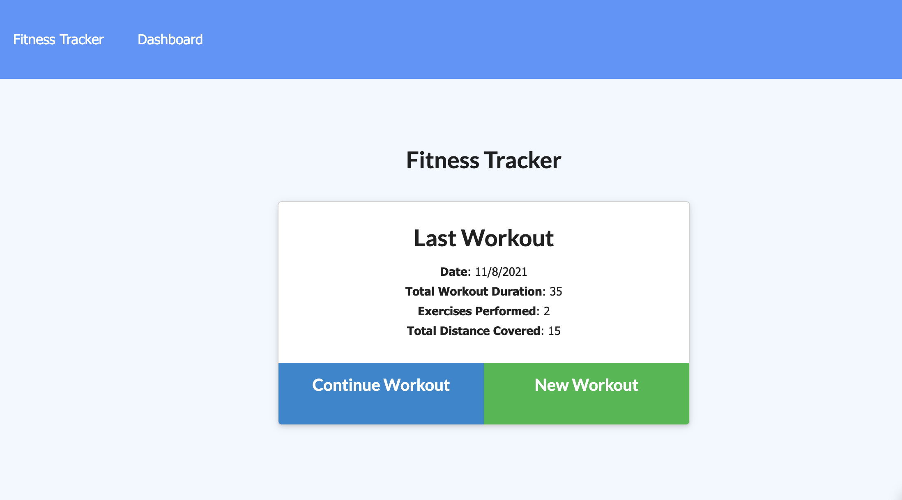
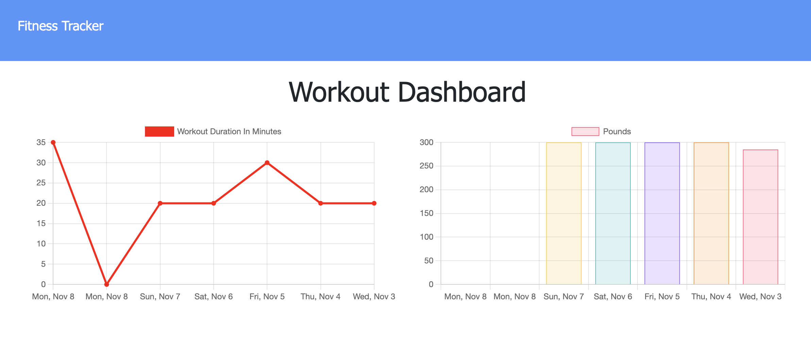
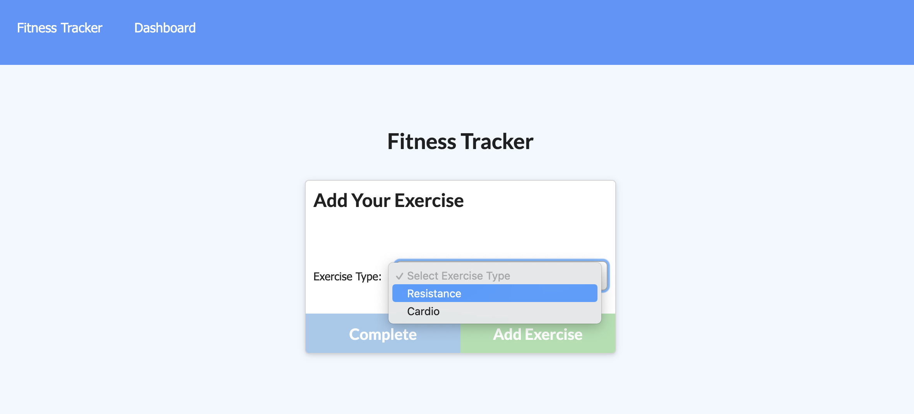

# Workout-Tracker


## Description

Workout tracker is a web application which helps user to track its workout activities. There are two types of exercise available. One is resistance, and the other one is cardio. By inputting exercise name, weight, sets, reps and duration time, this app will generate a line chart and a bar chart to display the recent seven days workout activities. In the home page, it also display the last workout activity.

## Table of Content

- [URL Link to GitHub Repository](#url-link-to-github-repository)
- [URL link to deploy in Heroku](#url-link-to-deploy-in-heroku)
- [Mock-Up Image](#mock-up-image)
- [Requirements](#requirements)
- [Installation](#installation)
- [License](#license)
- [Questions](#questions)

## URL Link to GitHub Repository

https://github.com/jingwang6028/Workout-Tracker

## URL link to deploy in Heroku

https://mongodb18-workout-tracker.herokuapp.com/

## Mock-Up Image

Home Page


Dashboard Page


Add exercise


## Requirements

```
Node.js
Express
npm
Mongoose
MongoDB

```

## Installation

1. For install npm packages, run command:
   ```
   npm i
   ```
2. For insert seed data into database
   ```
   node seeders/seed.js
   ```
3. To run this app
   ```
   node server.js
   ```

## License

This project is licensed under the MIT license.

## Questions

If you have any questions about the repo, open an issue or contact me directly at jingwang6028@gmail.com. You can find more of my work at [jingwang6028](https://github.com/jingwang6028).
